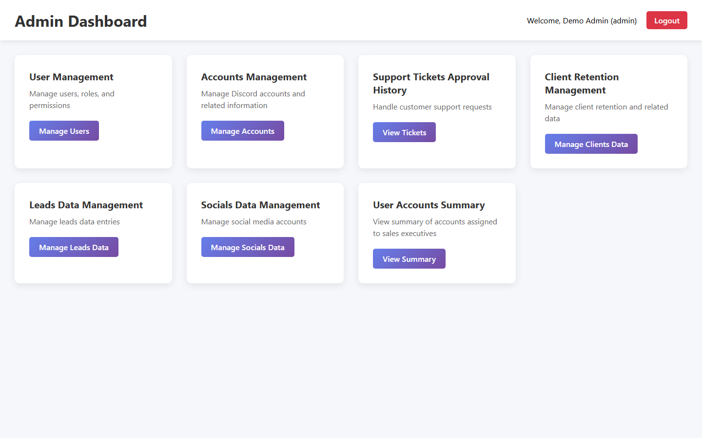
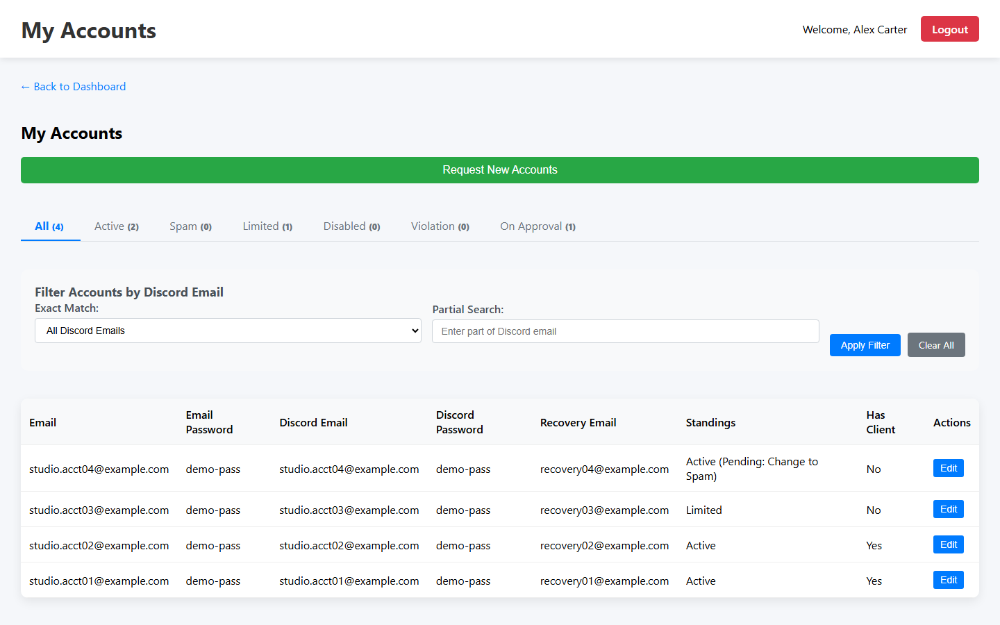
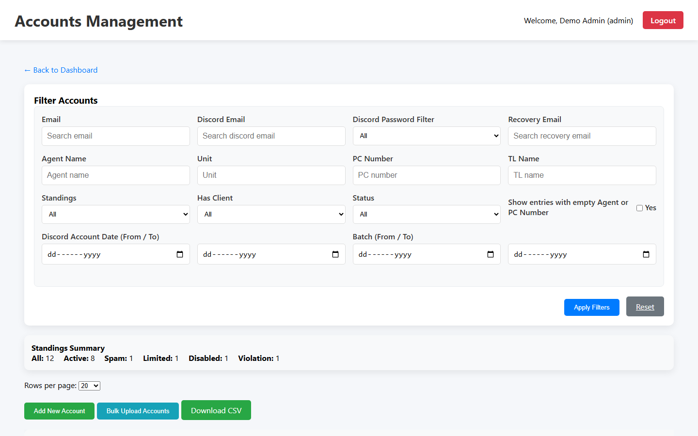
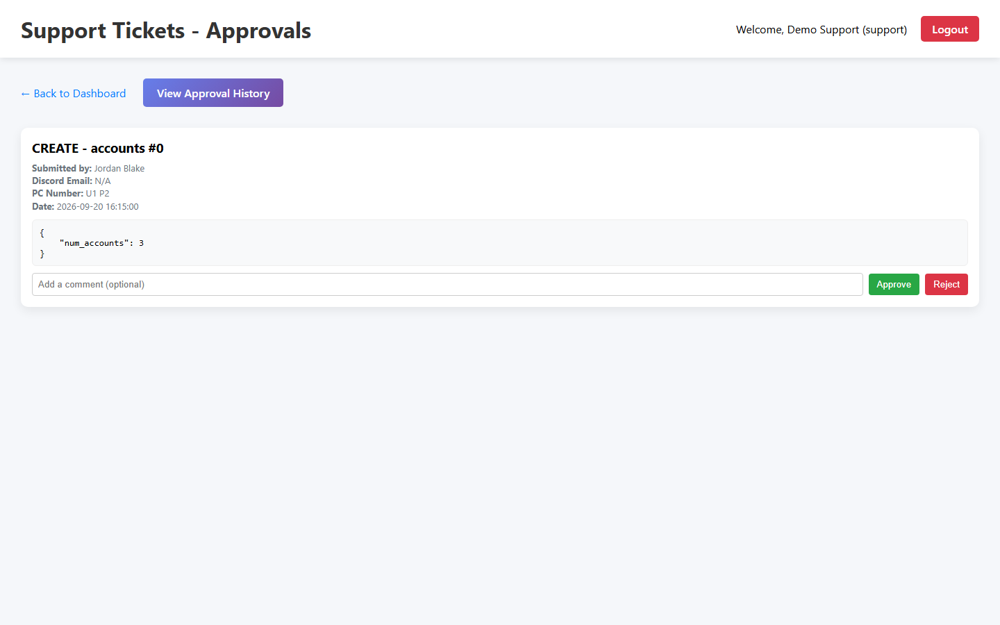
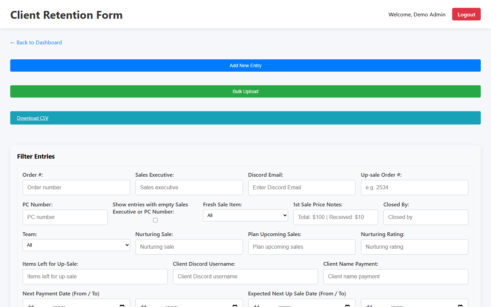
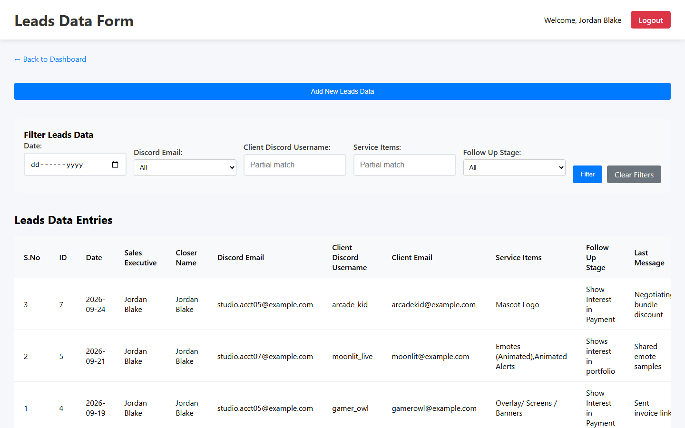

# SalesHub — Sales Account & Client Management System

A role-based internal operations platform for a digital-services sales team, built with **plain PHP 8 + MySQL**.
It manages the full sales workflow: shared platform accounts, leads, closed sales and client retention, with a **maker-checker approval queue** so every sensitive change is reviewed before it goes live.

> **Background:** I built SalesHub as an in-house tool for the company I work at, developed with AI-assisted programming. It replaced a set of shared spreadsheets and Google Forms that the sales floor used daily. This public version is sanitized: every name, email, and credential in it is fictional demo data.



---

## Table of contents

- [Features](#features)
- [Screenshots](#screenshots)
- [Tech stack](#tech-stack)
- [Getting started](#getting-started)
- [Demo logins](#demo-logins)
- [Project structure](#project-structure)
- [Security notes](#security-notes)
- [Documentation](#documentation)
- [License](#license)

## Features

**Four roles, each with its own dashboard**

| Role | What they do |
|------|--------------|
| **Admin** | Full control: users, accounts inventory, all data modules, approval history, per-agent summary |
| **Support** | Day-to-day operations: processes the approval queue (support tickets), manages data |
| **Team Lead** | Team overview dashboard (placeholder, ready to extend) |
| **Sales Executive** | Works their assigned accounts, logs leads, client retention and social accounts |

**Modules**

- **Accounts management:** inventory of shared platform accounts, account health (Active / Spam / Limited / Disabled / Violation), assignment to workstations, filters, CSV bulk upload and export.
- **Leads pipeline:** capture prospects, services of interest, follow-up stage and loss reasons.
- **Client retention:** closed sales, payment installments, next-payment and upsell dates, nurturing rating, and a **"Today's tasks"** view of what's due today.
- **Socials data:** social media accounts linked to each platform account.
- **Approval workflow (maker-checker):** agents' edits, deletes and account requests go into a queue; support/admin approve or reject with comments; full history is kept. Live pending-count badge with a sound alert.
- **User management:** create users, assign roles and workstation (PC) numbers. Passwords are bcrypt-hashed.
- **Access controls:** role-based page guards, desktop-only enforcement per role, and optional office-network IP restriction.

## Screenshots

| Login | Sales executive — my accounts |
|---|---|
|  |  |

| Accounts management | Support — approval queue |
|---|---|
|  |  |

| Client retention management | Leads data |
|---|---|
|  |  |

## Tech stack

- **Backend:** PHP 8 (procedural, no framework), MySQLi with prepared statements, PHP sessions
- **Database:** MySQL / MariaDB (utf8mb4)
- **Frontend:** server-rendered HTML, vanilla JavaScript (fetch/AJAX), custom CSS
- **Environment:** XAMPP (Apache + MariaDB) on Windows; runs on any LAMP/WAMP stack

## Getting started

### Prerequisites

- PHP **8.0+** with the `mysqli` extension
- MySQL **8+** or MariaDB **10.4+**
- Apache (e.g. [XAMPP](https://www.apachefriends.org/)), or PHP's built-in server for a quick look

### Option A: XAMPP (recommended)

1. Clone the repo into your web root:
   ```bash
   git clone https://github.com/NazimAli28/SalesHub-PHP-Account-Client-Management-System.git C:/xampp/htdocs/saleshub
   ```
2. Start **Apache** and **MySQL** from the XAMPP control panel.
3. Create the database and demo data. In phpMyAdmin (`http://localhost/phpmyadmin`), use **Import** with `database/saleshub.sql`. Or from a terminal:
   ```bash
   C:/xampp/mysql/bin/mysql.exe -u root < database/saleshub.sql
   ```
4. Open **http://localhost/saleshub/** and sign in with a [demo login](#demo-logins).

### Option B: PHP built-in server

```bash
mysql -u root < database/saleshub.sql
```
```bash
php -S localhost:8000
```
Then open http://localhost:8000.

### Configuration

Defaults (`root` with no password, database `saleshub`) match a fresh XAMPP install. To change anything, copy the example file and edit it. The copy is git-ignored:

```bash
cp config/config.local.example.php config/config.local.php
```

| Setting | Default | Purpose |
|---|---|---|
| `DB_HOST` / `DB_USER` / `DB_PASS` / `DB_NAME` | `localhost` / `root` / *(empty)* / `saleshub` | Database connection |
| `APP_TIMEZONE` / `DB_TIMEZONE_OFFSET` | `Asia/Karachi` / `+05:00` | PHP and MySQL timezone |
| `IP_RESTRICTION_ENABLED` | `false` | Restrict agent pages to `$allowed_ip_ranges` (office network) |

## Demo logins

All demo users share the password **`Demo@123`**.

| Username | Role | Notes |
|---|---|---|
| `admin` | Admin | Full access |
| `support` | Support | Approval queue + data management |
| `tl` | Team Lead | Team lead dashboard |
| `agent1` | Sales Executive | Workstation `U1 P1` (Alex Carter) |
| `agent2` | Sales Executive | Workstation `U1 P2` (Jordan Blake) |

> Change or delete these users before using SalesHub for real work.

## Project structure

```text
.
├── index.php                 # Login page (entry point)
├── api/                      # JSON endpoints used by the dashboards (AJAX)
├── assets/                   # CSS and alert sound
├── config/
│   ├── config.php            # DB connection, timezone, IP restriction helpers
│   └── config.local.example.php
├── dashboards/               # One PHP page per screen (role-guarded)
├── includes/                 # Login/logout handlers, device detection
├── database/saleshub.sql     # Schema + fictional demo data
├── samples/                  # Example CSVs for the bulk-upload features
├── scripts/                  # CLI maintenance scripts
└── docs/                     # User guide, admin runbook, API reference, screenshots
```

## Security notes

- Staff passwords are hashed with `password_hash()` (bcrypt); login uses prepared statements and `password_verify()`.
- All pages and JSON endpoints check the session role before doing anything.
- Output is escaped with `htmlspecialchars()`, and database access uses prepared statements.
- Local credentials live in the git-ignored `config/config.local.php`.

**Known limitations (possible future improvements):**
- No CSRF tokens on forms yet.
- Shared platform/social account credentials are stored in plaintext because agents need to read them. A production deployment should encrypt these at rest (e.g. libsodium) or move them to a secrets vault.

## Documentation

- [User guide](docs/USER_GUIDE.md): workflows per role
- [Admin runbook](docs/ADMIN_RUNBOOK.md): setup, operations, troubleshooting
- [API endpoints](docs/API_ENDPOINTS.md): request/response reference
- [Form specification](docs/FORM_SPEC.md): original field spec for the retention and lead forms

## License

© Nazim Ali. **All rights reserved.** This repository is published as a portfolio showcase. You're welcome to browse the code and run it locally to evaluate it. Any other use (copying, modifying, redistributing, or commercial use) requires written permission. See [LICENSE](LICENSE).
