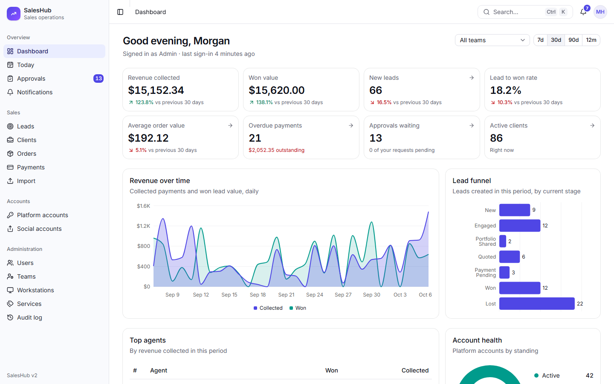
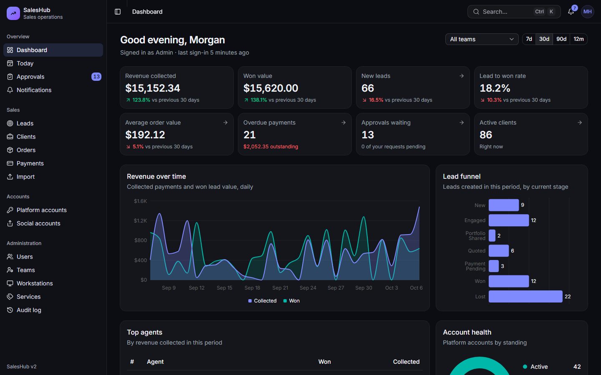
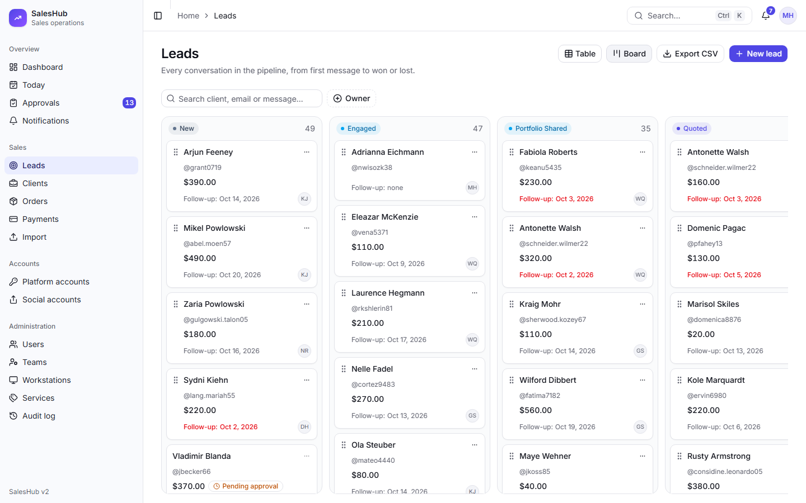
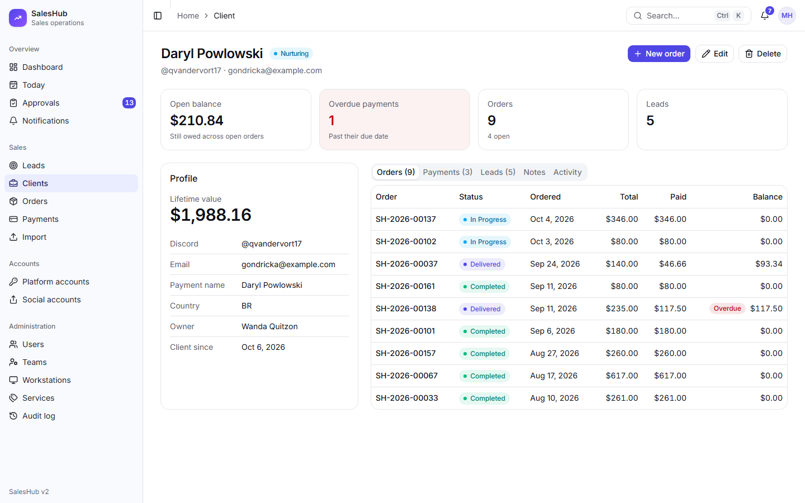
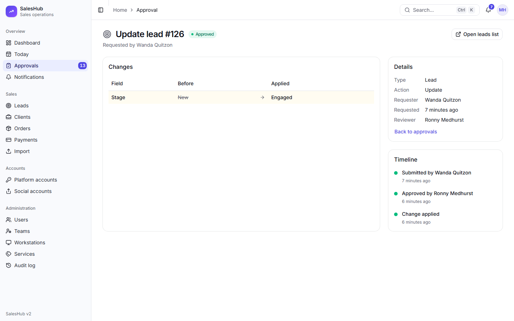
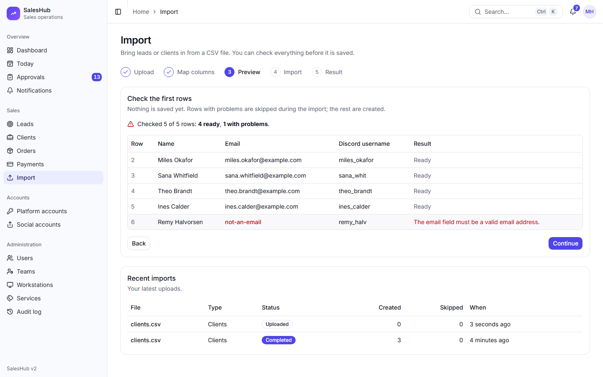
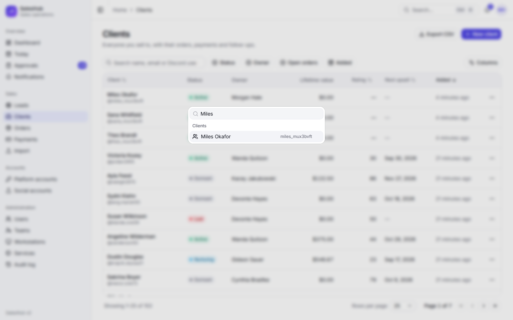
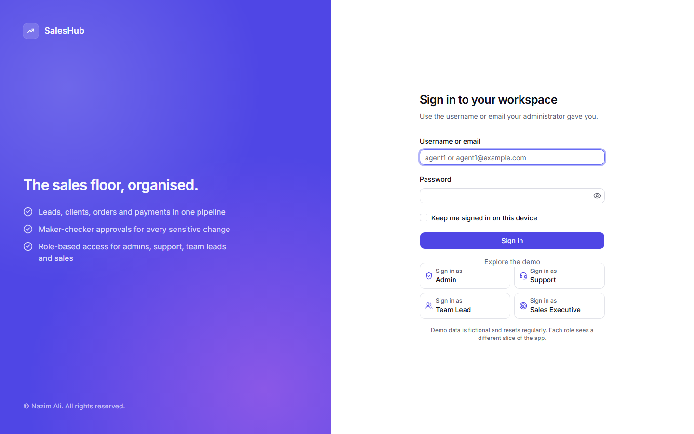
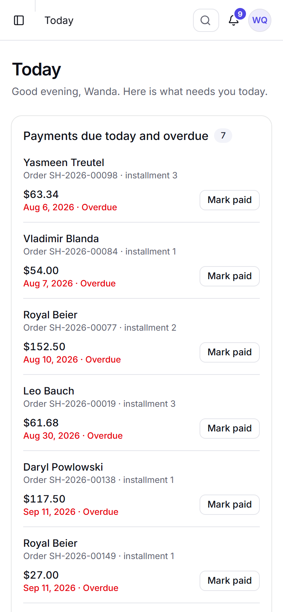
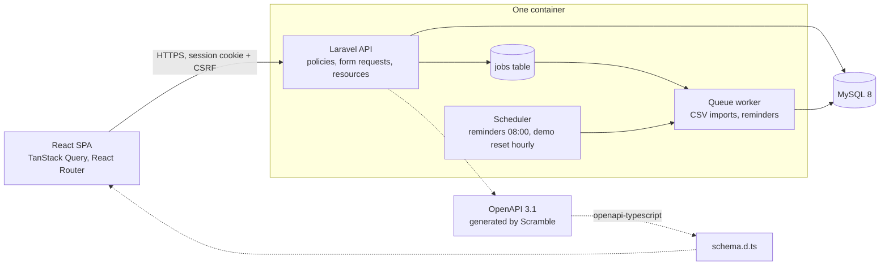

# SalesHub

**A role-based sales operations platform: leads, clients, orders and payments, a shared account inventory, and a maker-checker approval workflow. Laravel 13 REST API plus a React 19 + TypeScript single-page app.**

[](https://github.com/NazimAli28/SalesHub-PHP-Account-Client-Management-System/actions/workflows/ci.yml)


**Live demo:** <https://saleshub-demo.onrender.com> _(link added at launch)_

The demo runs on a free tier, so the first request after a quiet period can take up to a minute while the container wakes up. Data is fictional and the database is rebuilt every hour.

| Role            | Username  | What this role sees                                                            |
| --------------- | --------- | ------------------------------------------------------------------------------ |
| Admin           | `admin`   | Everything: all teams, users, audit log, analytics, credential reveal          |
| Support         | `support` | Operations across teams: accounts, approvals queue, clients, orders            |
| Team lead       | `tl`      | Their own team's leads, clients and agents; reviews the team's change requests |
| Sales executive | `agent1`  | Only their own records; edits go through approval; has a daily **Today** list  |

The password for every demo account is `Demo@12345`. The login page also has one-click "Sign in as" buttons.



## Screenshots

|                                                                                                                                                                                                           |                                                                                                                                                                                   |
| --------------------------------------------------------------------------------------------------------------------------------------------------------------------------------------------------------- | --------------------------------------------------------------------------------------------------------------------------------------------------------------------------------- |
| <br>**Dashboard, dark theme.** KPIs with period comparison, revenue, funnel, leaderboard and account health, scoped to what the role may see. | <br>**Leads board.** Drag-and-drop Kanban with keyboard moves; a change that needs approval shows a pending badge.                |
| <br>**Client 360.** Orders, payments, leads, pinned notes and an activity timeline in one place.                                                            | <br>**Maker-checker approvals.** The reviewer sees what changed, who asked, and the full timeline.           |
| <br>**CSV import wizard.** Upload, map columns, preview with row-level errors, then a background run.                                             | <br>**Ctrl+K command palette.** Searches clients, leads, orders and platform accounts without ever returning credentials. |
| <br>**Sign-in.** Optional two-factor, with demo quick-login on the public demo.                                                                                | <br>**Responsive.** The sales executive's daily **Today** list on a phone.                                                 |

## Why this project

SalesHub v1 was an in-house tool I built for my company with plain PHP and MySQL. It worked, and people used it every day, but I knew where it fell short: no CSRF protection, shared credentials stored in plain text, money kept as free text, no foreign keys, and 2,000-line page files. v2 is a ground-up rebuild that fixes those problems and applies production habits: a documented API, typed contracts, role-based permissions enforced on the server, automated tests, accessibility checks and CI. It is also my portfolio project for trainee and junior frontend, backend and full-stack roles. Everything in the demo is fictional data.

## Features

**Sales pipeline**

- Leads as a server-side table or a drag-and-drop Kanban board (keyboard accessible, optimistic moves with rollback)
- Lost-reason and won-order dialogs on stage changes
- Clients with a Client 360 view: orders, payments, leads, pinned notes, activity timeline
- Orders with line items, totals in cents, payment schedules, mark-paid, due and overdue lists
- A daily **Today** page of due payments and follow-ups, and payment reminders by notification bell and email

**Accounts**

- Shared platform-account inventory with standings, workstation assignment and social accounts
- Credentials are encrypted at rest, write-only in the UI, and revealed through an audited endpoint that auto-hides after 30 seconds

**Approvals (maker-checker)**

- Users who may only _request_ changes get `202 Accepted`; the change waits in a queue for a team lead or support user
- Before and after diff, bulk approve and reject, timeline, rejection of stale or double-decided requests

**Analytics**

- Role-aware dashboard for any date range: KPIs against the previous period, revenue over time, lead funnel, leaderboard, account health, upcoming payments

**Import and export**

- CSV import wizard for leads and clients (map, preview, queued run, downloadable error report)
- Streamed CSV export that is safe against spreadsheet formula injection

**Security**

- Four roles, 71 permissions, policies, row-level scoping, audit log with redacted diffs
- Optional TOTP two-factor sign-in with recovery codes, browser sessions list, login throttling, security headers

## Architecture



In production the built SPA is served by the same container as the API, so the browser sees a single origin. See [docs/deployment.md](docs/deployment.md).

Key design decisions:

- **Sanctum cookie auth instead of tokens.** The SPA and API share an origin, so an httpOnly session cookie plus CSRF protection is simpler and safer than keeping bearer tokens in JavaScript-readable storage.
- **Permissions, policies and row scoping.** One matrix ([`PermissionMatrix`](backend/app/Support/PermissionMatrix.php)) defines role to permission. Policies check the permission, and a `visibleTo($user)` scope limits which rows each role can see, so list endpoints and single-record endpoints agree. There is no blanket admin bypass.
- **Maker-checker approval engine.** A change request stores a snapshot of the record. Approval re-checks the snapshot, so a request made against stale data is rejected rather than silently overwriting newer work, and it applies in a transaction. Each module only adds a small applier.
- **URL-driven server-side tables.** Page, sort, filters and search live in the URL, so views are shareable and the back button works. The API paginates, filters and sorts.
- **One route file per module.** `backend/routes/api/*.php`, loaded automatically, with a [module guide](docs/api/module-guide.md) so every module is built the same way.
- **Encrypted credentials with audited reveal.** Secrets use encrypted casts, are hidden from serialization, and only the reveal endpoints return them. Those log which fields were revealed, never the values.
- **Generated OpenAPI into TypeScript types.** Scramble builds the spec from the code and `openapi-typescript` turns it into `schema.d.ts`, so a backend change that breaks the frontend fails the type check.

More detail: [data model](docs/architecture/data-model.md), [auth and permissions](docs/architecture/auth-and-permissions.md), [API conventions](docs/api/conventions.md), [frontend architecture](docs/frontend/architecture.md).

## Quality

| Check               | Result                                                                                                                              |
| ------------------- | ----------------------------------------------------------------------------------------------------------------------------------- |
| Backend tests       | 632 Pest tests; every endpoint has feature tests, including permission denials                                                      |
| Frontend tests      | 215 Vitest + Testing Library tests with the API mocked by MSW                                                                       |
| End-to-end          | 73 Playwright tests, including 50 axe accessibility scans (WCAG 2.1 A/AA) in light and dark mode                                    |
| Static analysis     | Larastan level 8, strict TypeScript, oxlint, Pint, Prettier                                                                         |
| CI (GitHub Actions) | Backend (Pint, Larastan, Pest, `composer audit`), frontend (lint, format, types, tests, build, `npm audit`), e2e (Playwright + axe) |
| Security            | [SECURITY.md](SECURITY.md) and an [OWASP Top 10 checklist](docs/security/owasp-top-10.md)                                           |

## Tech stack

| Layer    | Technology                                                                                                                                               |
| -------- | -------------------------------------------------------------------------------------------------------------------------------------------------------- |
| Backend  | Laravel 13, PHP 8.4, Sanctum (SPA cookie auth), spatie/laravel-permission, spatie/laravel-activitylog, spatie/laravel-query-builder, Google2FA           |
| Frontend | React 19, TypeScript (strict), Vite, Tailwind CSS 4, shadcn/ui (Radix), TanStack Query and Table, React Router, React Hook Form + Zod, Recharts, dnd-kit |
| Database | MySQL 8 (SQLite in memory for backend tests)                                                                                                             |
| Quality  | Pest, Larastan, Pint, Vitest, Testing Library, MSW, Playwright, axe-core, oxlint, Prettier                                                               |
| API docs | OpenAPI 3.1 generated by Scramble: interactive at `/docs/api`, file at [`docs/api/openapi.json`](docs/api/openapi.json)                                  |
| Delivery | GitHub Actions CI, Docker image for deployment                                                                                                           |

## Repository layout

```text
backend/               Laravel API (app/, routes/api/*.php, database/, tests/)
frontend/              React + TypeScript SPA (src/, e2e/)
docs/
  api/                 Conventions, module guide, feature endpoints, openapi.json
  architecture/        Data model, auth and permissions
  frontend/            Architecture and screen guide
  security/            OWASP Top 10 checklist
  screenshots/         Images used in this README
  deployment.md        Production deployment
docker-compose.yml     MySQL + Mailpit for local development
.github/workflows/     CI
```

## Local development

**Requirements:** PHP 8.3+ (with `intl`, `zip`, `pdo_mysql`, `sodium`), Composer 2, Node.js 20+, and MySQL 8 or Docker.

```bash
# MySQL on host port 3307 and Mailpit on http://localhost:8025 (or use any MySQL 8 and edit backend/.env)
docker compose up -d
```

```bash
cd backend
composer install
cp .env.example .env
php artisan key:generate
php artisan migrate --seed   # schema, roles and about six months of fictional demo data
php artisan serve            # http://localhost:8000
```

CSV imports and payment reminders run on the queue and the scheduler. Start both in extra terminals from `backend/` when you need them:

```bash
php artisan queue:work       # imports and reminder notifications
php artisan schedule:work    # payments:send-reminders daily at 08:00
```

```bash
cd frontend
npm install
cp .env.example .env.local   # optional; VITE_DEMO_MODE=true shows the demo sign-in buttons
npm run dev                  # http://localhost:5173 (proxies /api and /sanctum to :8000)
```

Sign in with any demo account from the table above (password `Demo@12345`). Checks:

```bash
cd backend  && composer lint && composer analyse && php vendor/bin/pest
cd frontend && npm run lint && npm run format:check && npm run typecheck && npm test && npm run build
cd frontend && npx playwright install chromium && npm run e2e   # starts its own API and Vite servers
cd frontend && npm run screenshots                               # regenerates docs/screenshots
```

More: [backend/README.md](backend/README.md), [frontend/README.md](frontend/README.md).

## Deploy

One Docker image serves the API and the SPA on a single origin (FrankenPHP, with SQLite for the demo), and runs the scheduler alongside the web server.

- Build: `docker build -t saleshub:demo --build-arg VITE_DEMO_MODE=true .`, then run it with `APP_URL`, `SANCTUM_STATEFUL_DOMAINS` and `DEMO_MODE=true`.
- Free live demo: **New → Blueprint** on Render using [`render.yaml`](render.yaml); the health check is `/up`.
- The demo reseeds every hour and on every boot, so a cold start takes about a minute.
- Environment variables, security notes and a MySQL setup are in [docs/deployment.md](docs/deployment.md).

## v1 versus v2

v1 lives on the [`v1` branch](../../tree/v1) and the [`v1.0` tag](../../tree/v1.0).

|                      | v1 (plain PHP)                                 | v2 (this branch)                                                         |
| -------------------- | ---------------------------------------------- | ------------------------------------------------------------------------ |
| Architecture         | Server-rendered pages, 700 to 2,500 lines each | REST API + React SPA, one route file and one policy per module           |
| Stack                | PHP 8, mysqli, sessions                        | Laravel 13, Sanctum, React 19, TypeScript, Tailwind, shadcn/ui           |
| CSRF                 | None                                           | Sanctum CSRF cookie flow, httpOnly session cookie                        |
| Credentials          | Plain text                                     | Encrypted at rest, hidden from serialization, audited reveal             |
| SQL                  | Some concatenated queries                      | Eloquent and bound parameters only                                       |
| Data integrity       | No foreign keys                                | Foreign keys and migrations                                              |
| Money                | Free text                                      | Integer cents, formatted in one place                                    |
| Authorization        | Role checks in page code                       | Permission matrix, policies, row scoping, maker-checker approvals        |
| Team lead and mobile | Placeholder dashboard, mobile blocked          | Role-aware dashboard, responsive layout                                  |
| Quality              | Manual testing                                 | 632 + 215 + 73 automated tests, static analysis, accessibility scans, CI |

## Roadmap

- [x] **Phase 0:** monorepo setup, tooling, CI
- [x] **Phase 1:** database schema, authentication, roles and permissions
- [x] **Phase 2:** core REST API (accounts, clients, leads, orders and payments, approvals)
- [x] **Phase 3:** frontend foundation (app shell, auth, data tables, design system)
- [x] **Phase 4:** all v1 screens rebuilt
- [x] **Phase 5:** analytics dashboard, Kanban pipeline, Client 360, import/export, payment reminders, two-factor sign-in
- [x] **Phase 6:** end-to-end tests, accessibility and security hardening
- [x] **Phase 7:** production Docker image, live demo and v2.0 release

## What I learned

- **Design the permission model before the endpoints.** Writing the role-to-permission matrix and the row-scoping rules first meant policies, the UI's hidden buttons and the tests all came from one source.
- **A rebuild is a chance to remove classes of bugs.** Encrypted casts, Eloquent only, foreign keys and integer money removed whole groups of v1's problems instead of patching them one by one.
- **Approval workflows are mostly about stale data.** The interesting cases were not "approve" and "reject" but a record that changed after the request, and two reviewers deciding at once.
- **Accessibility is cheapest when it is automated early.** Running axe in light and dark mode on every screen found contrast and landmark problems while they were still small, including my own.
- **Types across the API boundary pay off.** Generating TypeScript types from the OpenAPI file turned several would-be runtime bugs into compile errors.
- **Demo data deserves care.** Realistic fictional data, an hourly reset and guards on the shared accounts took more thought than expected, and made the whole project easier to evaluate.
- **Slow feedback loops hide problems.** The backend suite takes many minutes locally, which pushed me to write focused tests and to keep a fast path for the code I was changing.

## License

All rights reserved. © 2026 Nazim Ali. See [LICENSE](LICENSE). Viewing the code and running it locally to evaluate it is welcome; any other use (copying, modifying, redistributing or commercial use) needs written permission.
