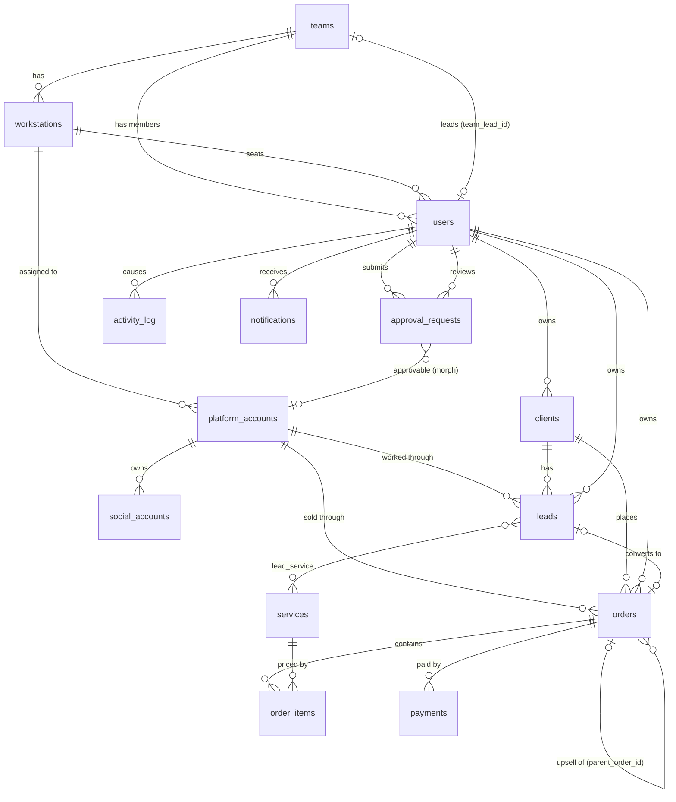

# SalesHub v2 — Data Model

Status: approved design for Phase 1. Implement exactly; deviations need a note in this file.

## 1. Principles

| Topic | Rule |
|-------|------|
| Portability | Must migrate on MySQL 8.4 (dev/prod) and SQLite `:memory:` (tests). No DB `enum()` columns, no CHECK constraints, no generated columns, no partial indexes. Enumerations are `string` columns backed by PHP enums in `app/Enums`. |
| Keys | `$table->id()` (unsigned bigint) everywhere except `notifications` (uuid, Laravel default). FKs via `foreignId()->constrained()`. |
| Deletes | Business tables use `softDeletes()`. FKs between business tables use `restrictOnDelete()` (hard deletes are rare and must be deliberate); optional user references use `nullOnDelete()`; pure children (order_items, payments, lead_service) use `cascadeOnDelete()`. |
| Secrets | Credential columns are `text` with the `encrypted` cast (AES-256 via `APP_KEY`). Encrypted columns are never indexed, searched, logged, or serialized by default (`$hidden`). |
| Money | Integer minor units (`*_cents`, `unsignedInteger`) plus `currency` `char(3)` (ISO 4217, default `USD`). Never floats or free text. |
| Time | Timestamps in UTC. Calendar-only values (due dates, batch dates) use `date`. |
| Links | Every v1 string link (pc_number, discord_email, agent_name, tl_name, team text) becomes a foreign key. |

## 2. Entity-relationship diagram

Polymorphic `approval_requests.approvable` and `activity_log.subject` can point at any approvable/logged model; only one edge is drawn.

## 3. Enums (`app/Enums`, all `string`-backed, each with a `label(): string` method)

| Enum | Cases => value |
|------|----------------|
| `RoleName` | `Admin => 'admin'`, `Support => 'support'`, `TeamLead => 'team_lead'`, `SalesExecutive => 'sales_executive'` |
| `Shift` | `Morning => 'morning'`, `Evening => 'evening'`, `Night => 'night'` |
| `AccountStanding` | `Active => 'active'`, `Limited => 'limited'`, `Spam => 'spam'`, `Violation => 'violation'`, `Disabled => 'disabled'` |
| `SocialPlatform` | `Instagram`, `X => 'x'`, `Behance`, `Dribbble`, `ArtStation => 'artstation'`, `TikTok => 'tiktok'`, `YouTube => 'youtube'`, `Facebook`, `Pinterest`, `Other` (values = lowercase name) |
| `ServiceCategory` | `Branding => 'branding'`, `Emotes => 'emotes'`, `Overlays => 'overlays'`, `Packages => 'packages'`, `Animation => 'animation'`, `Other => 'other'` |
| `LeadStage` | see 3.1 |
| `LeadLostReason` | `NoResponse => 'no_response'`, `Price => 'price'`, `ChoseCompetitor => 'chose_competitor'`, `NotReady => 'not_ready'`, `Spam => 'spam'`, `Other => 'other'` |
| `ClientStatus` | `Active => 'active'`, `Nurturing => 'nurturing'`, `Dormant => 'dormant'`, `Lost => 'lost'` |
| `OrderType` | `Fresh => 'fresh'`, `Upsell => 'upsell'` |
| `OrderStatus` | `PendingPayment => 'pending_payment'`, `InProgress => 'in_progress'`, `Delivered => 'delivered'`, `Completed => 'completed'`, `Cancelled => 'cancelled'`, `Refunded => 'refunded'` |
| `PaymentStatus` | `Scheduled => 'scheduled'`, `Paid => 'paid'`, `Void => 'void'` ("overdue" is derived, see 5) |
| `PaymentMethod` | `PayPal => 'paypal'`, `Stripe => 'stripe'`, `Wise => 'wise'`, `BankTransfer => 'bank_transfer'`, `Other => 'other'` |
| `ApprovalAction` | `Create => 'create'`, `Update => 'update'`, `Delete => 'delete'`, `RequestAccounts => 'request_accounts'` |
| `ApprovalStatus` | `Pending => 'pending'`, `Approved => 'approved'`, `Rejected => 'rejected'`, `Cancelled => 'cancelled'`, `Failed => 'failed'` |

### 3.1 Lead pipeline

| Order | `LeadStage` case => value | Meaning | v1 `follow_up_stage` text mapped here |
|------|-----------------------------|---------|----------------------------------------|
| 1 | `New => 'new'` | First contact made, no reply yet | empty, "New", "Sent first message" |
| 2 | `Engaged => 'engaged'` | Client replied / conversation going | "Replied", "Talking" |
| 3 | `PortfolioShared => 'portfolio_shared'` | Interested in work samples | "Shows interest in portfolio" |
| 4 | `Quoted => 'quoted'` | Price/package sent | "Asked price", "Sent quote" |
| 5 | `PaymentPending => 'payment_pending'` | Agreed, awaiting first payment | "Show Interest in Payment" |
| 6 | `Won => 'won'` | Paid; an order exists (`leads.order_id` set) | — |
| 7 | `Lost => 'lost'` | Requires `lost_reason`; free-text `lost_note` holds v1 `scenario_if_lost` | any text with `scenario_if_lost` filled |

`LeadStage::isOpen()` returns true for stages 1–5. `LeadStage::ordered()` returns cases in the order above for Kanban columns.

## 4. Tables

Column notation: `type` is the Laravel Blueprint method. `N` = nullable. All tables have `timestamps()` unless stated.

### 4.1 `users` (alter existing migration in a new migration)

| Column | Type | Null/Default | Notes |
|--------|------|--------------|-------|
| id | id | | |
| name | string(120) | | |
| username | string(50) | unique | login identifier, lowercase, `[a-z0-9._-]` |
| email | string | unique | existing |
| email_verified_at | timestamp | N | existing |
| password | string | | `hashed` cast |
| team_id | foreignId → teams | N, nullOnDelete | added in a migration **after** `teams` (circular FK) |
| workstation_id | foreignId → workstations | N, nullOnDelete | sales executives only |
| avatar_path | string | N | path on `public` disk |
| is_active | boolean | default true | inactive users cannot log in |
| last_login_at | timestamp | N | |
| last_login_ip | string(45) | N | |
| remember_token | rememberToken | | existing |
| deleted_at | softDeletes | | |

Reserved for Phase 5 (do not add now): `two_factor_secret` text N, `two_factor_recovery_codes` text N, `two_factor_confirmed_at` timestamp N.
Indexes: `team_id`, `workstation_id` (FK indexes), `is_active`.
Model `User`: casts `email_verified_at`/`last_login_at` datetime, `is_active` boolean, `password` hashed. Relationships: `team(): BelongsTo`, `workstation(): BelongsTo`, `ledTeam(): HasOne(Team, 'team_lead_id')`, `leads(): HasMany(Lead, 'owner_id')`, `orders(): HasMany(Order, 'owner_id')`, `clients(): HasMany(Client, 'owner_id')`, `approvalRequests(): HasMany(ApprovalRequest, 'requested_by_id')`. Fillable adds `username, team_id, workstation_id, avatar_path, is_active`. Uses `SoftDeletes`.

### 4.2 `teams`

| Column | Type | Null/Default | Notes |
|--------|------|--------------|-------|
| id | id | | |
| name | string(80) | unique | e.g. "Unit 1 Alpha" |
| floor | unsignedTinyInteger | | |
| shift | string(20) | | `Shift` |
| team_lead_id | foreignId → users | N, nullOnDelete | |
| deleted_at | softDeletes | | |

Model `Team`: casts `shift => Shift`. `teamLead(): BelongsTo(User)`, `members(): HasMany(User)`, `workstations(): HasMany`. Accessor `display_name` = "Unit 1 Alpha (Floor 3 Evening)" (replaces v1 hardcoded strings).

### 4.3 `workstations` (replaces `pc_number`)

| Column | Type | Null/Default | Notes |
|--------|------|--------------|-------|
| id | id | | |
| code | string(20) | unique | e.g. `PC-07` (v1 pc_number) |
| team_id | foreignId → teams | restrictOnDelete | |
| label | string(80) | N | |
| is_active | boolean | default true | |
| deleted_at | softDeletes | | |

Model `Workstation`: `team(): BelongsTo`, `users(): HasMany`, `platformAccounts(): HasMany`. Several users may share one workstation across shifts.

### 4.4 `platform_accounts` (v1 `accounts`)

| Column | Type | Null/Default | Notes |
|--------|------|--------------|-------|
| id | id | | |
| email | string | unique | mailbox login (plain; needed for search) |
| email_password | text | | **encrypted** |
| discord_email | string | N, unique | when different from `email` |
| discord_username | string(64) | N | |
| discord_password | text | | **encrypted** |
| discord_created_on | date | N | v1 discord_account_date |
| recovery_email | string | N | |
| recovery_phone | text | N | **encrypted** |
| phone_holder_name | text | N | **encrypted** |
| batch_date | date | | v1 account_batch |
| workstation_id | foreignId → workstations | N, nullOnDelete | NULL = unassigned (replaces v1 `status`) |
| assigned_at | timestamp | N | v1 discord_account_assigned_date |
| standing | string(20) | default `active` | `AccountStanding` |
| standing_changed_at | timestamp | N | |
| notes | text | N | |
| deleted_at | softDeletes | | |

Indexes: `(workstation_id, standing)` (dashboard counts per workstation), `standing`, `batch_date`.
Model `PlatformAccount`: casts `email_password`, `discord_password`, `recovery_phone`, `phone_holder_name` => `encrypted`; `standing => AccountStanding`; `discord_created_on`, `batch_date` => `date`; `assigned_at`, `standing_changed_at` => `datetime`. `$hidden` = the four encrypted columns. `workstation(): BelongsTo`, `socialAccounts(): HasMany`, `leads(): HasMany`, `orders(): HasMany`. Derived (not stored): agent/unit/TL via `workstation.team`, `has_client` via `withExists('orders')`.

### 4.5 `social_accounts` (v1 `socials_data`)

| Column | Type | Null/Default | Notes |
|--------|------|--------------|-------|
| id | id | | |
| platform_account_id | foreignId → platform_accounts | restrictOnDelete | replaces discord_email link |
| platform | string(20) | | `SocialPlatform` |
| username | string(100) | | handle |
| login_email | string | N | |
| password | text | | **encrypted** |
| created_on | date | N | |
| is_in_use | boolean | default false | v1 is_using |
| deleted_at | softDeletes | | |

Unique `(platform, username)`. Index `(platform_account_id, platform)`.
Model `SocialAccount`: casts `password => encrypted`, `platform => SocialPlatform`, `created_on => date`, `is_in_use => boolean`; `$hidden = ['password']`. `platformAccount(): BelongsTo`. Visibility follows the parent platform account.

### 4.6 `services` (new catalog)

| Column | Type | Null/Default | Notes |
|--------|------|--------------|-------|
| id | id | | |
| name | string(80) | | |
| slug | string(80) | unique | |
| category | string(20) | | `ServiceCategory` |
| description | text | N | |
| base_price_cents | unsignedInteger | | |
| currency | char(3) | default `USD` | |
| is_active | boolean | default true | |
| deleted_at | softDeletes | | |

Model `Service`: casts `category => ServiceCategory`, `is_active => boolean`. `orderItems(): HasMany`, `leads(): BelongsToMany(Lead, 'lead_service')`.

### 4.7 `clients` (new; replaces client columns spread over leads/client_retention)

| Column | Type | Null/Default | Notes |
|--------|------|--------------|-------|
| id | id | | |
| discord_username | string(64) | unique | primary handle |
| name | string(120) | N | |
| email | string | N | |
| payment_name | string(120) | N | v1 client_name_payment |
| country | char(2) | N | ISO 3166-1 alpha-2 |
| owner_id | foreignId → users | N, nullOnDelete | sales exec who owns the relationship |
| status | string(20) | default `active` | `ClientStatus` |
| nurturing_rating | unsignedTinyInteger | N | 0–100, validated in FormRequest |
| next_upsell_plan | text | N | v1 plan_upcoming_sales / items_left_upsale |
| expected_upsell_on | date | N | |
| lost_note | text | N | v1 if_client_lost |
| notes | text | N | v1 comments |
| deleted_at | softDeletes | | |

Indexes: `(owner_id, status)`, `expected_upsell_on`, `email`.
Model `Client`: casts `status => ClientStatus`, `expected_upsell_on => date`. `owner(): BelongsTo(User)`, `leads(): HasMany`, `orders(): HasMany`, `payments(): HasManyThrough(Payment, Order)`. Lifetime value is derived: `withSum` over paid payments.

### 4.8 `leads` (v1 `leads_data`)

| Column | Type | Null/Default | Notes |
|--------|------|--------------|-------|
| id | id | | |
| client_id | foreignId → clients | restrictOnDelete | lead creation also creates/links client by discord_username |
| owner_id | foreignId → users | restrictOnDelete | v1 sales_executive |
| closer_id | foreignId → users | N, nullOnDelete | v1 closer_name |
| platform_account_id | foreignId → platform_accounts | N, nullOnDelete | v1 discord_email |
| stage | string(30) | default `new` | `LeadStage` |
| stage_changed_at | timestamp | | set on create and every stage change |
| contacted_on | date | | v1 date |
| estimated_value_cents | unsignedInteger | N | |
| currency | char(3) | default `USD` | |
| last_message | text | N | |
| next_follow_up_on | date | N | |
| lost_reason | string(30) | N | `LeadLostReason`, required when stage = lost |
| lost_note | text | N | v1 scenario_if_lost |
| order_id | foreignId → orders | N, nullOnDelete | set when won (added in a migration after `orders`) |
| deleted_at | softDeletes | | |

Indexes: `(stage, owner_id)` (Kanban per exec), `(owner_id, contacted_on)` (my leads by date), `(contacted_on)` (period reports), `next_follow_up_on`.
Pivot `lead_service`: `lead_id` (cascadeOnDelete), `service_id` (restrictOnDelete), primary key `(lead_id, service_id)`, no timestamps. Replaces v1 CSV `service_items`.
Model `Lead`: casts `stage => LeadStage`, `lost_reason => LeadLostReason`, dates. `client(): BelongsTo`, `owner(): BelongsTo(User)`, `closer(): BelongsTo(User)`, `platformAccount(): BelongsTo`, `services(): BelongsToMany(Service, 'lead_service')`, `order(): BelongsTo(Order)`.

### 4.9 `orders` (v1 `client_retention`)

| Column | Type | Null/Default | Notes |
|--------|------|--------------|-------|
| id | id | | |
| order_number | string(20) | unique | `SH-YYYY-NNNNN`, generated in `OrderNumberGenerator` |
| client_id | foreignId → clients | restrictOnDelete | |
| owner_id | foreignId → users | restrictOnDelete | v1 sales_executive |
| closer_id | foreignId → users | N, nullOnDelete | v1 closed_by |
| team_id | foreignId → teams | N, nullOnDelete | **snapshot** of owner's team at sale time (reports stay stable when people move) |
| platform_account_id | foreignId → platform_accounts | N, nullOnDelete | |
| parent_order_id | foreignId → orders | N, nullOnDelete | upsell of (v1 upsale_order_number) |
| type | string(10) | default `fresh` | `OrderType` |
| status | string(20) | default `pending_payment` | `OrderStatus` |
| currency | char(3) | default `USD` | |
| subtotal_cents | unsignedInteger | default 0 | stored, see 5 |
| discount_cents | unsignedInteger | default 0 | |
| total_cents | unsignedInteger | default 0 | stored, see 5 |
| ordered_on | date | | |
| delivered_at | timestamp | N | |
| notes | text | N | |
| deleted_at | softDeletes | | |

Indexes: `(owner_id, ordered_on)`, `(team_id, ordered_on)` (team reports), `(status, ordered_on)`, `client_id`.
Model `Order`: casts `type => OrderType`, `status => OrderStatus`, `ordered_on => date`, `delivered_at => datetime`. `client()`, `owner()`, `closer()`, `team()`, `platformAccount()`, `parent(): BelongsTo(Order)` — all BelongsTo; `upsells(): HasMany(Order, 'parent_order_id')`, `items(): HasMany(OrderItem)`, `payments(): HasMany(Payment)`, `lead(): HasOne(Lead)`.

### 4.10 `order_items`

| Column | Type | Null/Default | Notes |
|--------|------|--------------|-------|
| id | id | | |
| order_id | foreignId → orders | cascadeOnDelete | |
| service_id | foreignId → services | restrictOnDelete | |
| description | string | N | custom spec, e.g. "3 sub-badge emotes" |
| quantity | unsignedSmallInteger | default 1 | |
| unit_price_cents | unsignedInteger | | copied from `services.base_price_cents`, editable |
| line_total_cents | unsignedInteger | | `quantity * unit_price_cents` |

No soft deletes (lifecycle owned by the order). Index `service_id`. Model `OrderItem`: `order(): BelongsTo`, `service(): BelongsTo`.

### 4.11 `payments` (installments)

| Column | Type | Null/Default | Notes |
|--------|------|--------------|-------|
| id | id | | |
| order_id | foreignId → orders | cascadeOnDelete | |
| sequence | unsignedTinyInteger | | 1, 2, 3… within order |
| amount_cents | unsignedInteger | | |
| currency | char(3) | | must equal order currency |
| due_date | date | | v1 next_payment_date |
| status | string(10) | default `scheduled` | `PaymentStatus` |
| paid_at | timestamp | N | set iff status = paid |
| method | string(20) | N | `PaymentMethod` |
| reference | string(100) | N | processor transaction id |
| recorded_by_id | foreignId → users | N, nullOnDelete | |
| notes | text | N | |
| deleted_at | softDeletes | | |

Unique `(order_id, sequence)`. Indexes: `(status, due_date)` (overdue + upcoming lists), `paid_at` (revenue by period).
Model `Payment`: casts `status => PaymentStatus`, `method => PaymentMethod`, `due_date => date`, `paid_at => datetime`. `order(): BelongsTo`, `recordedBy(): BelongsTo(User)`. Scopes: `scopeOverdue` (`status = scheduled AND due_date < today`), `scopeDueBetween($from, $to)`. Accessor `is_overdue`.

### 4.12 `approval_requests` (v1 `approvals`)

| Column | Type | Null/Default | Notes |
|--------|------|--------------|-------|
| id | id | | |
| action | string(20) | | `ApprovalAction` |
| approvable_type | string | N | morph alias (see below); null only for `request_accounts` |
| approvable_id | unsignedBigInteger | N | null for `create` and `request_accounts` |
| payload | json | | proposed data, shapes below |
| before | json | N | snapshot at submission (update/delete) |
| after | json | N | snapshot written on successful apply |
| status | string(20) | default `pending` | `ApprovalStatus` |
| pending_key | string(100) | N, **unique** | `"{type}:{id}"` while pending; NULL otherwise (see 6.4) |
| reason | text | N | requester's justification |
| requested_by_id | foreignId → users | restrictOnDelete | |
| reviewed_by_id | foreignId → users | N, nullOnDelete | |
| reviewed_at | timestamp | N | |
| review_comment | text | N | required on reject |
| applied_at | timestamp | N | |
| failure_message | text | N | when status = failed |

Indexes: `(status, created_at)` (queue), `(approvable_type, approvable_id, status)` (pending badge), `(requested_by_id, status)`. No soft deletes (append-only history).
Model `ApprovalRequest`: casts `action => ApprovalAction`, `status => ApprovalStatus`, `payload/before/after => array`, `reviewed_at/applied_at => datetime`. `approvable(): MorphTo`, `requester(): BelongsTo(User, 'requested_by_id')`, `reviewer(): BelongsTo(User, 'reviewed_by_id')`.
Morph map (enforced in `AppServiceProvider` with `Relation::enforceMorphMap`): `platform_account`, `social_account`, `client`, `lead`, `order`, `payment`, `user`.

### 4.13 `activity_log` (spatie/laravel-activitylog)

Install `spatie/laravel-activitylog` (latest major supporting Laravel 13) and publish its migrations (`activity_log` with `log_name`, `description`, `subject` morph, `causer` morph, `properties` json, `event`, `batch_uuid`). Add index `(log_name, created_at)`. Set `config/activitylog.php` `delete_records_older_than_days` = 365. If the package does not yet support Laravel 13, create a custom table with the identical schema and an `Activity` model so a later switch is a drop-in. See 7 for what is logged.

### 4.14 `notifications`

Laravel default (`php artisan make:notifications-table`): uuid `id`, `type`, `notifiable` morphs, `data` text, `read_at`. Notification classes: `ApprovalSubmitted` (to reviewers), `ApprovalDecided` (to requester), `PaymentOverdue` (to owner + team lead, sent by daily scheduled command `payments:notify-overdue`), `AccountStandingChanged` (to users on the workstation). Channel: `database` only in Phase 1.

## 5. Money rules

| Value | Stored or derived | Why |
|-------|-------------------|-----|
| `order_items.line_total_cents` | Stored | Immutable price history; catalog price changes must not alter old orders. |
| `orders.subtotal_cents`, `total_cents` | Stored, recomputed only by `App\Actions\Orders\RecalculateOrderTotals` inside the same transaction that writes items | Fast list sorting/filtering and report sums without joins. `total = subtotal - discount`, never negative. |
| Amount paid / balance | **Derived**: `withSum(['payments as paid_cents' => status = paid], 'amount_cents')`; `balance = total - paid` | Payments are the single source of truth; a stored counter would drift on edits/voids. |
| Overdue | Derived (scope) | Depends on "today"; storing it needs a cron and can go stale. |

Invariants (enforced in actions/FormRequests, covered by tests): all payments of an order share its currency; sum of non-void payments must equal `total_cents` when the schedule is saved (the last installment absorbs rounding); a paid payment cannot be edited except via approval by support/admin. Formatting to "$1,234.50" happens in API Resources (`amount_cents` + `amount_formatted`) and the frontend.

## 6. Approval requests (maker-checker)

### 6.1 What goes through approval

| Actor | Create | Update | Delete |
|-------|--------|--------|--------|
| sales_executive | Direct for leads, clients, orders (+items, payments). Platform accounts: `request_accounts` only. | Via approval (all approvable models in own scope) | Via approval |
| team_lead | Direct (team scope) | Direct for leads/clients/orders of team; via approval for payments marked paid | Via approval |
| support / admin | Direct | Direct | Direct |

The decision is permission-driven (see auth doc): `{resource}.update`/`.delete` = direct, `{resource}.request-change` = goes to the queue. Controllers return `202 Accepted` with the `ApprovalRequestResource` when a change is queued.

### 6.2 Payload shapes

| action | approvable | payload | before |
|--------|-----------|---------|--------|
| create | type set, id null | `{"attributes": {...validated fields...}, "relations": {"services": [1,4]}}` | null |
| update | type + id | `{"changes": {"stage": "quoted", "last_message": "..."}}` — only changed, validated fields | `{"stage": "portfolio_shared", "last_message": "...", "updated_at": "2026-09-30T10:12:00Z"}` — same keys plus `updated_at` |
| delete | type + id | `{}` | full `toArray()` of the record (encrypted attributes excluded) |
| request_accounts | null | `{"workstation_id": 7, "quantity": 2, "note": "two accounts limited this week"}` | null |

Payloads are validated with the same FormRequest rules as a direct write before being stored (an approved request must never fail validation later). Encrypted fields (credentials) are never put in payloads; credential changes are support/admin-only direct writes.

### 6.3 Before snapshot

`App\Actions\Approvals\SubmitApprovalRequest` loads the model, takes `Arr::only($model->getAttributes(), array_keys($changes))` after cast-to-JSON (`$model->only(...)` via `attributesToArray`), adds `updated_at`, and stores it in `before`. The UI renders a field diff `before → payload.changes`.

### 6.4 Apply / reject

`App\Actions\Approvals\ReviewApprovalRequest::approve(ApprovalRequest $r, User $reviewer, ?string $comment)`:

1. `DB::transaction(function () { ... })`.
2. Re-fetch with `ApprovalRequest::whereKey($id)->lockForUpdate()->firstOrFail()`; if `status !== Pending` throw `ApprovalAlreadyDecided` (HTTP 409).
3. Reviewer may not be the requester (403) and must pass `ApprovalRequestPolicy::review`.
4. Stale check (update/delete): if the record's current `updated_at` differs from `before.updated_at`, mark `failed` with `failure_message = "Record changed since request was submitted"` and return 409.
5. Apply: create → `Model::create(attributes)` + sync relations, then set `approvable_id`; update → `$model->fill($changes)->save()`; delete → `$model->delete()` (soft); request_accounts → no data write, reviewer then assigns accounts (status approved = fulfilled).
6. Update request: `status = approved`, `reviewed_by_id`, `reviewed_at`, `review_comment`, `applied_at = now()`, `after = fresh attributes`, `pending_key = null`.
7. After commit: activity log entry + `ApprovalDecided` notification.

Reject: same lock + pending check, `review_comment` required (min 5 chars), `status = rejected`, `pending_key = null`, no data write. The requester may cancel own pending request (`status = cancelled`).

**Double-application protection** (three layers): row lock + status re-check inside the transaction; conditional state transition (`update ... where status = 'pending'` must affect exactly 1 row); unique `pending_key` so only one pending update/delete can exist per record (`"lead:42"`). A second submission for the same record returns 422 "This record already has a pending change". `create` and `request_accounts` leave `pending_key` null.

### 6.5 Showing pending changes on a record

Each approvable model uses trait `App\Models\Concerns\HasApprovals`: `approvalRequests(): MorphMany`, `pendingApproval(): MorphOne` (`status = pending`, latest). List and detail Resources include `pending_change: null | {id, action, fields: [...changed keys], requested_by, requested_at}` (eager-loaded via `with('pendingApproval.requester')`). The frontend shows a "Pending change" badge and the diff; this replaces v1 `pending_standings`.

### 6.6 Implementation notes (Phase 2)

- Class names: `App\Actions\Approvals\SubmitChangeRequest` (update/delete/create/request_accounts), `ApproveRequest`, `RejectRequest`, `CancelRequest` replace `SubmitApprovalRequest` / `ReviewApprovalRequest`. Writes go through per-alias appliers in `App\Approvals\Appliers` (see `docs/api/module-guide.md`).
- Update payloads may also carry `"relations": {"services": [1, 4]}`; `before`/`after` then include `"relations"` with the sorted ID lists.
- The staleness check compares the whole stored `before` snapshot (fields + `updated_at` + relations), not only `updated_at`. A target record that was deleted in the meantime also marks the request `failed` (409).
- `approval_request` was added to the morph map (approval activity entries use it as subject).
- A lead moves to `won` only through `PATCH /api/leads/{id}/stage` with an `order_id` of the same client (or by the Orders module); create/update reject `stage=won`.

## 7. Activity log

Use spatie/laravel-activitylog. Models use `LogsActivity` with `logOnly($fillable minus encrypted)`, `logOnlyDirty()`, `dontSubmitEmptyLogs()`.

| log_name | Events | subject | properties |
|----------|--------|---------|-----------|
| `model` | created/updated/deleted/restored on User, Team, Workstation, PlatformAccount, SocialAccount, Client, Lead, Order, OrderItem, Payment, Service | the model | `old`/`attributes` (no secrets, no password hashes) |
| `auth` | `login`, `logout`, `login_failed`, `login_locked_out`, `login_blocked_inactive`, `login_blocked_ip`, `password_changed` | User (null for unknown identifier) | `ip`, `user_agent`, `identifier` (failed only) |
| `security` | `credentials_revealed` | PlatformAccount or SocialAccount | `fields: ["discord_password"]`, `ip` — never values |
| `approval` | `submitted`, `approved`, `rejected`, `cancelled`, `failed` | ApprovalRequest | `action`, `approvable_type`, `approvable_id` |

Approved changes are logged twice by design: once as `approval.approved` (causer = reviewer) and once as `model.updated` (causer = reviewer, property `approval_request_id`).

## 8. Seeding plan

`DatabaseSeeder` calls, in order: `RolesAndPermissionsSeeder`, `TeamSeeder`, `WorkstationSeeder`, `UserSeeder`, `ServiceSeeder`, `PlatformAccountSeeder`, `SocialAccountSeeder`, `ClientSeeder`, `LeadSeeder`, `OrderSeeder` (items + payments), `ApprovalRequestSeeder`, `NotificationSeeder`. Use a fixed Faker seed (`fake()->seed(2026)`) so demos are reproducible, dates relative to `now()` going back 6 months, and disable activity logging during seeding except an `ActivityLogSeeder` that writes ~300 plausible entries.

| Table | Count | Factory | Notes |
|-------|-------|---------|-------|
| teams | 4 | `TeamFactory` | Alpha (F3 evening), Bravo (F3 night), Charlie (F4 evening), Delta (F4 night) |
| workstations | 12 | `WorkstationFactory` | `PC-01`…`PC-12`, 3 per team |
| users | 14 | `UserFactory` (states `admin()`, `support()`, `teamLead()`, `salesExecutive()`, `inactive()`) | 1 admin, 2 support, 4 team leads, 7 sales execs (one inactive) |
| services | 12 | `ServiceFactory` | Logo $80, Emote (each) $15, Sub badges set $45, Stream overlay $120, Full stream pack $350, Panels $40, Alerts $60, Animated emote $30, Banner $35, Starting/BRB screens $70, VTuber model sketch $200, Custom $0 |
| platform_accounts | 60 | `PlatformAccountFactory` | 48 assigned, 12 unassigned; standings ~70% active, 12% limited, 8% spam, 5% violation, 5% disabled |
| social_accounts | 120 | `SocialAccountFactory` | ~2 per account |
| clients | 150 | `ClientFactory` | fictional streamer handles, `@example.com` emails |
| leads | 400 | `LeadFactory` (states per stage) | spread over 6 months; ~45% open, 25% won, 30% lost |
| orders | 180 | `OrderFactory` (`upsell()`) | ~100 from won leads, ~80 upsells/repeat; 1–4 `OrderItemFactory` items each |
| payments | ~330 | `PaymentFactory` (`paid()`, `overdue()`) | 1–3 installments per order; ~20 overdue, ~30 upcoming |
| approval_requests | 40 | `ApprovalRequestFactory` | 12 pending, 18 approved, 8 rejected, 2 cancelled |
| notifications | ~60 | — | unread mix for demo users |

Demo logins (password `Demo@12345` for all; see open question in the auth doc):

| Role | Username | Email | Team / workstation |
|------|----------|-------|--------------------|
| admin | `admin` | admin@example.com | — |
| support | `support` | support@example.com | — |
| team_lead | `tl` | tl@example.com | Alpha |
| sales_executive | `agent1` | agent1@example.com | Alpha / PC-01 |
| sales_executive | `agent2` | agent2@example.com | Alpha / PC-02 |

## 9. v1 → v2 mapping

| v1 | v2 |
|----|----|
| `users.role` | spatie role (`team_lead` replaces `tl`) |
| `users.pc_number` | `users.workstation_id` |
| `accounts` | `platform_accounts` |
| `accounts.status` 0/1 | `platform_accounts.workstation_id` null / set |
| `accounts.agent_name`, `unit`, `tl_name`, `pc_number` | derived via `workstation → team → team_lead` |
| `accounts.account_batch` | `batch_date` |
| `accounts.has_client` | derived `withExists('orders')` |
| `accounts.pending_standings` | pending `approval_requests` row (`pending_change`) |
| `accounts.*password*`, recovery phone | encrypted columns |
| `socials_data` | `social_accounts` (FK `platform_account_id`) |
| `leads_data` | `leads` + `clients` |
| `leads_data.service_items` (CSV) | `lead_service` pivot |
| `leads_data.follow_up_stage` (text) | `leads.stage` (`LeadStage`) |
| `leads_data.scenario_if_lost` | `lost_reason` + `lost_note` |
| `leads_data.client_discord_username`, `client_email` | `clients.discord_username`, `clients.email` |
| `client_retention` | `orders` + `order_items` + `payments` + `clients` (nurturing fields) |
| `client_retention.first_sale_price` (free text) | `orders.total_cents` + `payments` |
| `client_retention.upsale_order_number` | `orders.parent_order_id` |
| `client_retention.team` (string) | `orders.team_id` snapshot |
| `client_retention.nurturing_rating`, `expected_next_upsale_date`, `if_client_lost`, `comments` | `clients.nurturing_rating`, `expected_upsell_on`, `lost_note`, `notes` |
| `approvals` | `approval_requests` (morph + before/after) |
| `approvals` used as support tickets | not migrated (open question) |
